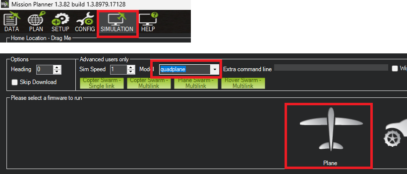
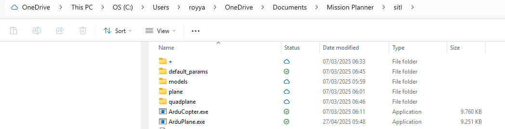
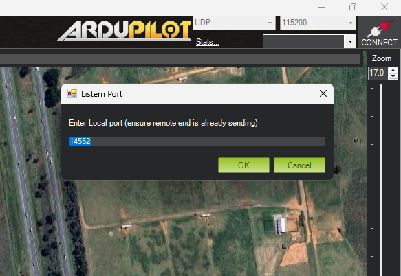
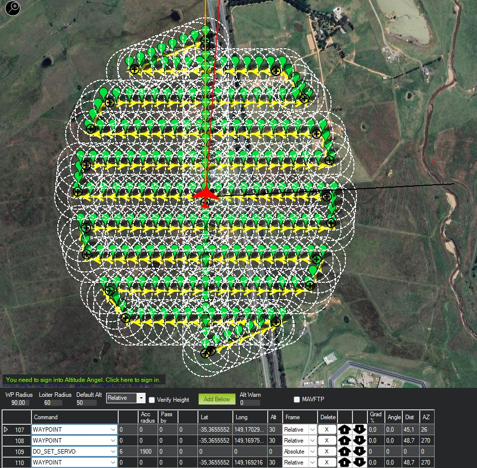
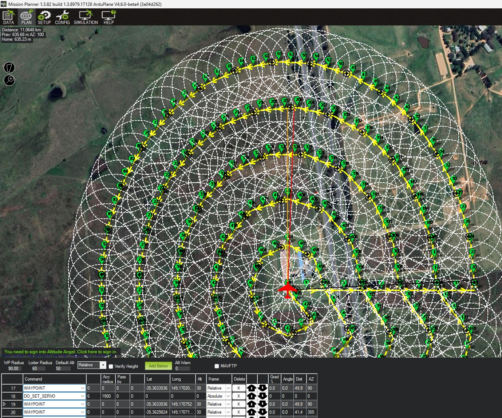
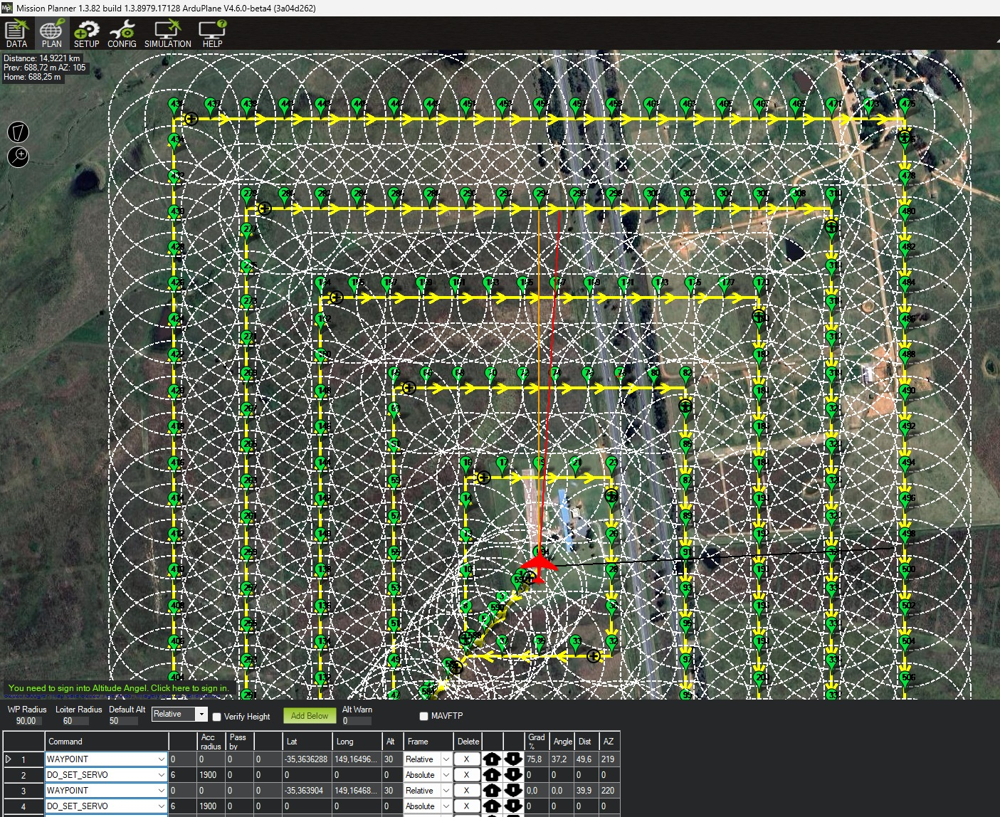

# MAVLink Waypoint Generator & Runner

A Python-based system for generating and uploading complex Waypoints through MAVLink. It also can send commands to run.

## Features

- Multiple shape patterns (circle, square, triangle)
- Different coverage styles (zigzag, inward/outward spiral)
- Precise spray control with configurable intervals
- MAVLink integration for ArduPilot/PX4 compatible drones
- Easy-to-configure parameters

## Getting Started

### Prerequisites

- Windows 10/11
- Python 3.8 or newer
- Git
- Mission Planner (needed to download the SITL)

### 1. Setup Software in The Loop (SITL)
- Open Mission Planner > `Simulation Tab`
- Choose `Quadplane` & `Plane`. Click ok to download SITL



- Find folder of SITL, mine is at `%USERPROFILE%\OneDrive\Documents\Mission Planner\sitl\ArduPlane.exe`



- Disconnect

- Activate Command Prompt
```bash
# Assign temporary variable
set MY_ARDUPILOT_SITL_FOLDER=%USERPROFILE%\Documents\Mission Planner\sitl

# or, choose this if you have OneDrive installed, your Documents folder probably have moved here
set MY_ARDUPILOT_SITL_FOLDER=%USERPROFILE%\OneDrive\Documents\Mission Planner\sitl

# Activate SITL
"%MY_ARDUPILOT_SITL_FOLDER%\ArduPlane.exe" -Mquadplane -O-35.3633522,149.1652409,587.067920000005,0 -s1 --serial0 tcp:127.0.0.1 --defaults "%MY_ARDUPILOT_SITL_FOLDER%\default_params\quadplane.parm"

# Activate mavproxy to broadcast to different IPs
mavproxy --master tcp:127.0.0.1:5887 --out udp:127.0.0.1:14550 --out udp:127.0.0.1:14552 --out udp:localhost:14601 --out udpin:localhost:14602 --out udpout:localhost:14603 --out udpbcast:192.168.2.255:14700
```

- Connect Mission Planner to the broadcasted MAVProxy
    - Choose `UDP`
    - Click on Connect, then fill in this in the port `14552`
    
    

### 2. Run Project

```bash
# Clone repository
git clone https://github.com/royyandzakiy/mavlink-waypoint-generator.git
cd mavlink-waypoint-generator

# Create virtual environment (do this just once)
python -m venv .venv

# Activate environment
.\.venv\Scripts\activate # .\.venv\Scripts\Activate.ps1 if using powershell

# Upgrade pip
python -m pip install --upgrade pip

# Install required packages
pip install pymavlink numpy

# Run the mission planner:
python run_generate_waypoint.py
```

### 3. Edit Confugration
Edit `config/mission_params.py` to set your mission parameters:
```
class MissionParams:
    def __init__(self):
        # Shape parameters
        self.shape_type = "circle"  # "circle", "triangle", or "square"
        self.radius_m = 500         # Distance from center to edge in meters
        
        # Pattern parameters
        self.pattern_type = "spiral_out"  # "zigzag", "spiral_out", or "spiral_in"
        self.stripe_separation_m = 100     # Distance between passes in meters
        self.rotation_deg = 45             # Rotation angle in degrees
        
        # Spray parameters
        self.spray_interval_m = 50   # Distance between spray triggers in meters
        self.servo_channel = 6      # PWM output channel (6-9 typically)
        self.servo_pwm = 1900       # PWM value for spray ON (1100-1900)
        
        # MAVLink parameters
        self.altitude = 30          # Mission altitude in meters
        self.connection_string = 'udp:localhost:14603'  # MAVProxy connection
```

### 4. Check Output
```bash
Waiting for heartbeat...
Heartbeat received!
Cleared existing mission.
Sent waypoint count: 127
Sending navigation waypoint 0...
Sending spray waypoint 1...
...
Mission uploaded successfully!
```

### Example
##### circle zigzag


##### circle_spiralin


##### square spiralout


### MISC
#### Configuring MAVProxy Ports
- Here is to understand the above Ports setup
    - ArduPlane.exe SITL runs on `TCP 127.0.0.1:5887`
    - MAVProxy directly connects to SITL at `TCP 127.0.0.1:5887`, MAVProxy then broadcasts to all the other Ports
    - MantisGCS connects to `UDP 127.0.0.1:14550`
    - Mission Planner connects to `UDP 127.0.0.1:14552` (optional)
    - QGroundControl connects to `UDP 127.0.0.1:14553` (optional)
    - mavlink-waypoint-generator connect to `UDP 127.0.0.1:14600++`

- To Modify the Ports setup:
    - `--serial0 tcp:127.0.0.1`: Port set for the SITL to run
    - `--master tcp:127.0.0.1:5887`: Port set as the master port, MAVProxy expects an SITL or HITL is running on this Port, for it to then Broadcast to other ports
    - `--out`: All Ports that MAVProxy Broadcasts towards, it is hence accessible by other applications, but only 1 application for 1 port
        - to understand `udpin` `udpout` `udpbcast` read more about [Pymavlink library](https://mavlink.io/en/mavgen_python/)

#### Run SITL
You can run the SITL with custuom commands through this script, modify it as needed

`python sandbox\mavlink_commander.py`

#### Known Errors
- stalling at `heartbeat...`, meaning your SITL and MAVProxy is not running properly, the `run_generate_waypoint.py` script cannot access the Port `UDP 127.0.0.1:14600`
```bash
(.venv) C:\Users\path\to\mavlink-waypoint-generator>python run_generate_waypoint.py
Waiting for heartbeat...
```